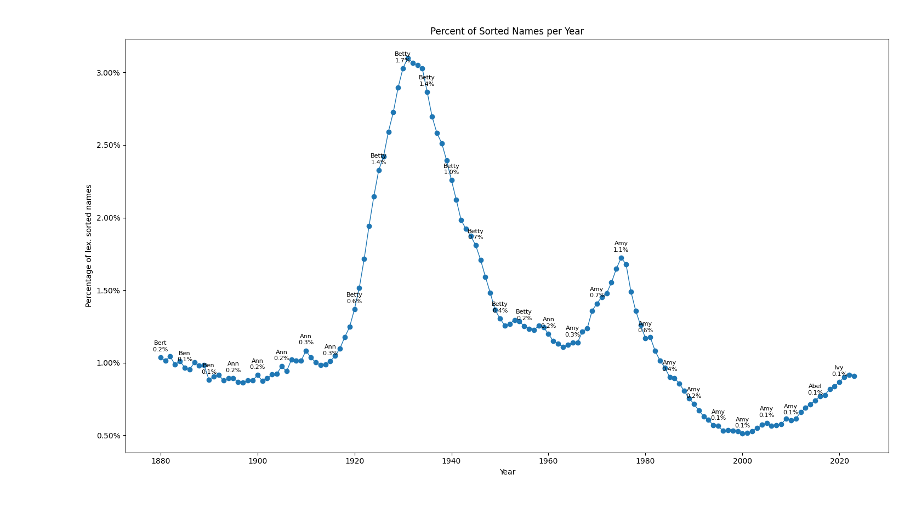

# Lexicographic Names

This is just a small repo for plotting the percentage of lexicographically sorted names by year.
It will first print out the longest lexicographically sorted name for the year specified in the config, and then make a nice plot of the percentage of lexicographically by year along with the most popular name every 5 years.

## Lexicographic Names by Year Plot

